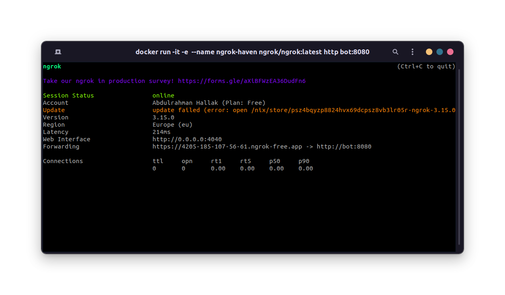

# Overview
WebHaven is a Telegram bot RSS Feed aggregator.
You can add and remove feeds through telegram and the bot also sends notifications for new
posts for your feeds.

The bot uses webhooks to listen for updates from telegram api.
If you want to learn more about webhooks for telegram see this awesome [guide](https://core.telegram.org/bots/webhooks)

The bot consists of three projects:
1. TelegramBot: This project the main application for the bot.
2. DatabaseMigrator: This is a command-line application that executes migrations against the database.
When you first run the app, make sure you execute the migration from this app first or you can just use
docker to run the app and everything will set-up automatically.

If you prefer not to use docker. Just go into the directory of the project and run the following command from the terminal:

`
dotnet run -- migrateup "provide the connection string here"
`

note the `--` this is necessary in order for the dotnet cli to understand that everything after it is application arguments
not options for the cli. When you publish the application you can run it normally without the `--`.

## Self Host
You can run your own instance easily using docker or even without docker but setting up docker is much easier :).

### Create a Telegram Bot
First create a telegram bot through [@BotFather](https://telegram.me/BotFather) and set the necessary commands in order for 
the commands to appear in telegram.
The bot currently uses the following commands:
- `/getfeeds`: Display the feeds user added to his account.
- `/addfeed`: Adds a feed to user account
- `/removefeed`: Removes a feed from user account
After you add the commands, obtain the token for your bot.

### Get a domain to register the webhook
The bot uses webhooks to recieve updates from telegram api so you need a public domain to register
the webhook. You can obtain a free one from [ngrok](https://ngrok.com/) or [zrok](https://zrok.io/).
We will be using ngrok since it is a bit easier to start with.

Go to ngrok webpage and sign-up for a new account.
After you sign-up, go to your dashboard and get an auth token because we will be running ngrok from docker
and you need an auth token for that

### Setting up the environment
Clone the repository and `cd` to the dir where dockerfiles are located. Create an .env file to use with docker compose.
The .env file should contain the following:

```
    CONNECTIONSTRINGS__POSTGRES="Server=db;Port=5432;Database=webhavendb;User Id=postgres;Password=;"

    TELEGRAMCONFIGURATION__SECRET=""

    TELEGRAMCONFIGURATION__HOSTADDRESS=""

    TELEGRAMCONFIGURATION__TOKEN=""

    POSTGRES_PASSWORD=""
```

add the telegram token from step 1. Fill in the rest of the variables except for
TELEGRAMCONFIGURATION__HOSTADDRESS, this will be added later.

### Running the app

First run the docker container for ngrok using the following command

`
docker run -it -e NGROK_AUTHTOKEN=<your-token> --name ngrok-haven ngrok/ngrok:latest http bot:8080
`

Add the token you obtained when making an ngrok account to the command.

You should now be presented with something like this:


copy the url in the Forwarding section and paste it into the `TELEGRAMCONFIGURATION__HOSTADDRESS` in the .env file.

Make sure you are in the directory where the compose.yaml file is and run the following command

`
docker compose -f compose.yaml --env-file .env up
`

Now we only need to connect the ngrok container to the bridge network of the bot created in the compose file for it to be
able to forward requests to the bot container.

To do so run the following command:

`
docker network connect webhaven-network ngrok-haven
`

Now everything should work correctly :)